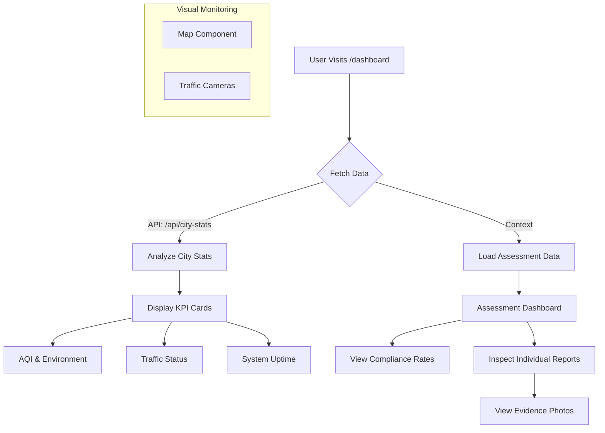
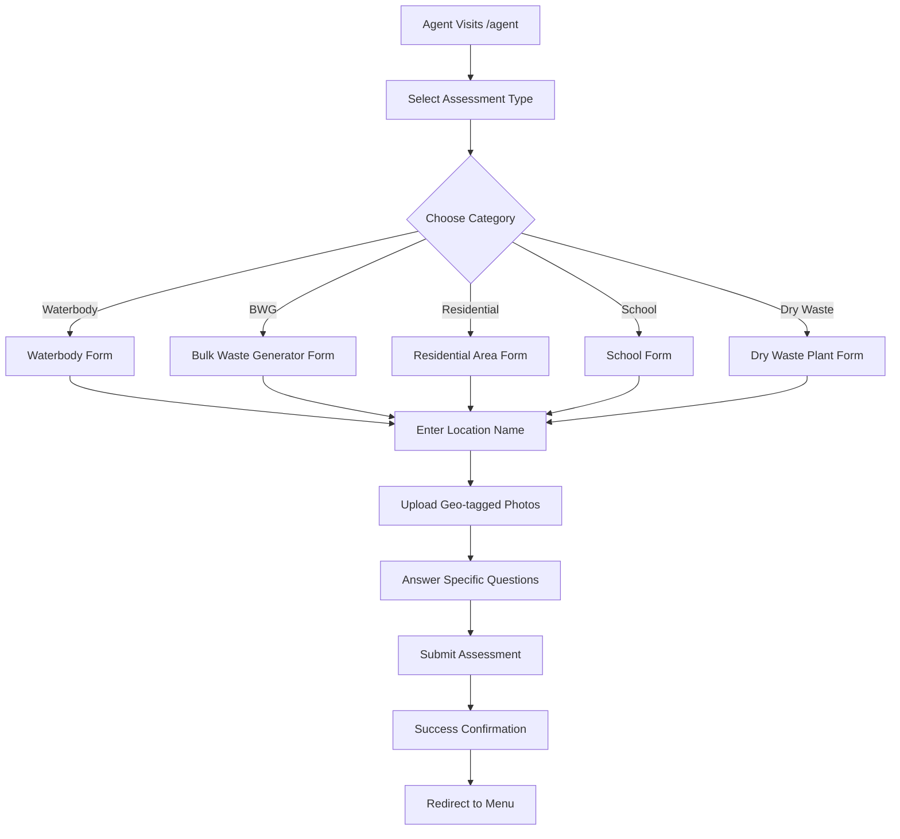

# ICC_DOC
# SMC-ICCC (Surat Smart City - Integrated Command and Control Centre) Project Documentation

## 1. Project Overview
The **SMC-ICCC** project is a comprehensive digital platform designed for the Surat Municipal Corporation to centralize city monitoring and management. It serves as the digital brain of the city, integrating various data streams—environmental sensors, traffic cameras, emergency alerts, and field assessments—into a single, intuitive interface.

This project aims to enhance the quality of life for citizens by enabling data-driven governance, improving response times to urban issues, and ensuring transparency in civic operations.

---

## 2. Key Features
*   **Real-time City Dashboard**: A centralized view of critical city metrics such as Air Quality Index (AQI), Traffic Mobility, Emergency Dispatch status, and System Uptime.
*   **Live Traffic Monitoring**: Integration of simulated live CCTV feeds from key city junctions (e.g., Sahara Darwaja, Delhi Gate) to monitor congestion.
*   **Environmental Monitoring**: Detailed breakdown of environmental data including PM2.5, PM10, and Humidity levels with status indicators (Good, Moderate, Poor).
*   **Field Agent Portal**: A dedicated mobile-responsive interface for field officers to conduct on-site assessments for various categories like Waterbodies, Bulk Waste Generators (BWG), and Schools.
*   **Assessment Analysis**: A dashboard module to analyze field reports, calculate compliance rates, and view image evidence submitted by agents.

---

## 3. User Flows

### 3.1 Public / City Official Flow (Dashboard)
This flow represents how a city official or administrator monitors the city's status.



### 3.2 Field Agent Flow (Data Collection)
This flow illustrates how field agents submit ground-level data.



---

## 4. API Reference

### GET `/api/city-stats`
Fetches real-time (and simulated) statistical data for the city.

**Response Structure (JSON):**
```json
{
  "aqi": {
    "value": "169",
    "status": "Poor",
    "color": "text-red-500",
    "pm25": { "value": "58 µg/m³", "status": "Moderate" },
    "pm10": { "value": "60 µg/m³", "status": "Moderate" },
    "humidity": { "value": "65%", "status": "Optimal" }
  },
  "traffic": {
    "value": "Moderate",
    "status": "Normal",
    "trend": "+2%"
  },
  "alerts": {
    "value": "5",
    "status": "Active"
  },
  "uptime": {
    "value": "99.98%",
    "status": "Stable"
  }
}
```

---

## 5. Important Code Snippets

### 5.1 Dashboard Data Fetching (`src/app/dashboard/page.tsx`)
This effect hook ensures the dashboard stays updated by polling the API every 5 minutes.
```tsx
React.useEffect(() => {
    fetchStats();
    const interval = setInterval(fetchStats, 300000); // Refresh every 5 minutes
    return () => clearInterval(interval);
}, []);
```

### 5.2 API Logic - Smart Caching & External Fetching (`src/app/api/city-stats/route.ts`)
The API intelligently combines real data (Open-Meteo for AQI) with simulated business logic (Traffic based on time of day) to provide a robust demonstration.
```typescript
// Fetch AQI from Open-Meteo
const aqiResponse = await fetch(
    `https://air-quality-api.open-meteo.com/v1/air-quality?latitude=${lat}&longitude=${lon}&current=pm2_5,pm10,us_aqi,relative_humidity_2m`
);

// Simulated Traffic Logic based on Time
const hours = istTime.getUTCHours();
if ((hours >= 8 && hours <= 11) || (hours >= 17 && hours <= 20)) {
    trafficStatus = 'Heavy';
    trafficValue = 'High';
}
```

### 5.3 Dynamic Assessment Form (`src/types/assessment.ts`)
The system is highly extensible, allowing new assessment types to be added simply by defining them in the configuration object.
```typescript
export const ASSESSMENT_QUESTIONS: Record<AssessmentType, AssessmentQuestion[]> = {
    Waterbody: [
        { id: '1', text: 'Is the waterbody found at the location?', type: 'yes-no' },
        { id: '2', text: 'Is there any solid waste floating/visible in waterbody?', type: 'yes-no' },
        // ... more questions
    ],
    // ... other categories
};
```

---

## 6. Real-World Impact
1.  **Enhanced Situational Awareness**: By aggregating data in one place, city administrators can see the "big picture" (e.g., correlating high traffic with poor AQI) and make informed decisions.
2.  **Resource Optimization**: Knowing exactly where traffic is heavy or where waste is accumulating (via field reports) allows for the precise deployment of police or sanitation workers.
3.  **Proactive Governance**: Instead of waiting for citizen complaints, the ICCC allows the administration to detect issues (like rising particulate matter or traffic jams) proactively.

---

## 7. Swachh Bharat Mission (SBM) Alignment
This project is deeply integrated with the goals of the Swachh Bharat Mission (Clean India Mission):

1.  **Centralized Garbage Monitoring**: The **BWG (Bulk Waste Generator)** and **Dry Waste** assessment modules allow the corporation to track if large entities (hotels, societies) are managing waste correctly.
2.  **Water Body Rejuvenation**: The **Waterbody** assessment checklist (checking for floating waste, weeds, open dumping) directly supports the SBM goal of keeping water bodies clean.
3.  **Digital "Swachhata" Audit**: The **Agent Portal** digitizes the inspection process. Instead of paper forms, agents upload real-time photos (`geo-tagged` capable) of dumpsites (GVPs - Garbage Vulnerable Points), ensuring accountability and irrefutable proof of work.
4.  **Compliance Tracking**: The dashboard calculates **"Compliance Rates"** automatically. This gamification and metric-tracking drives better performance from different zones/wards in the city.
