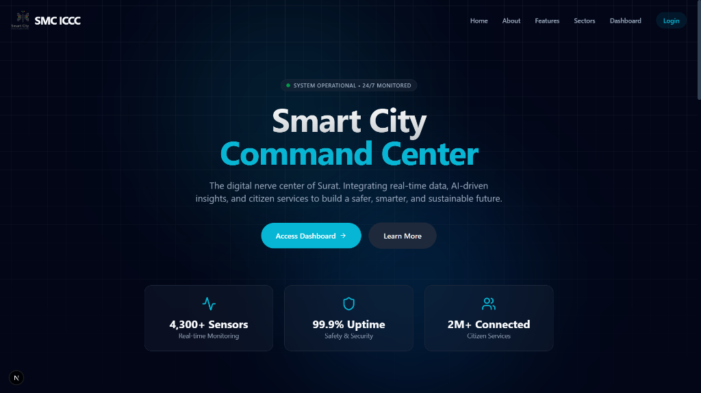
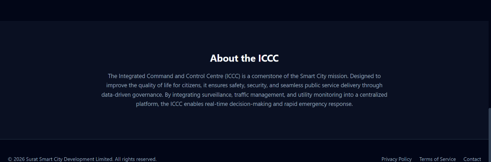
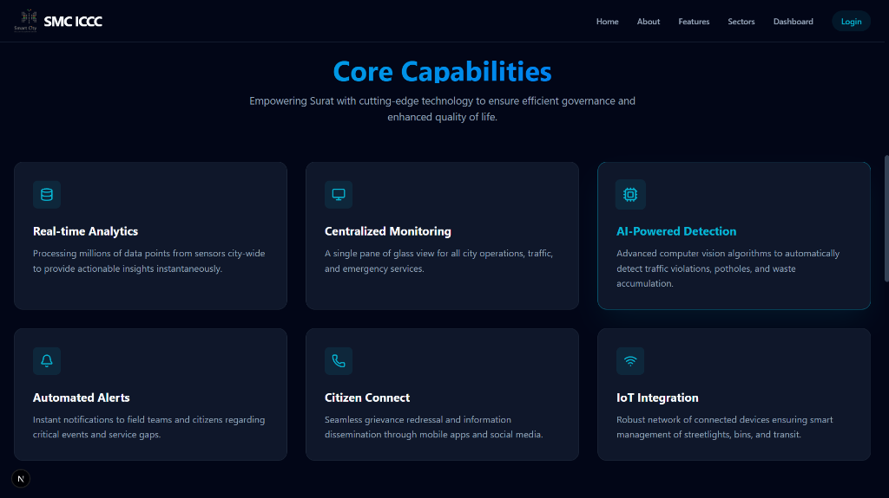
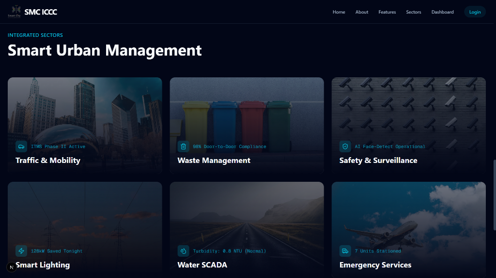
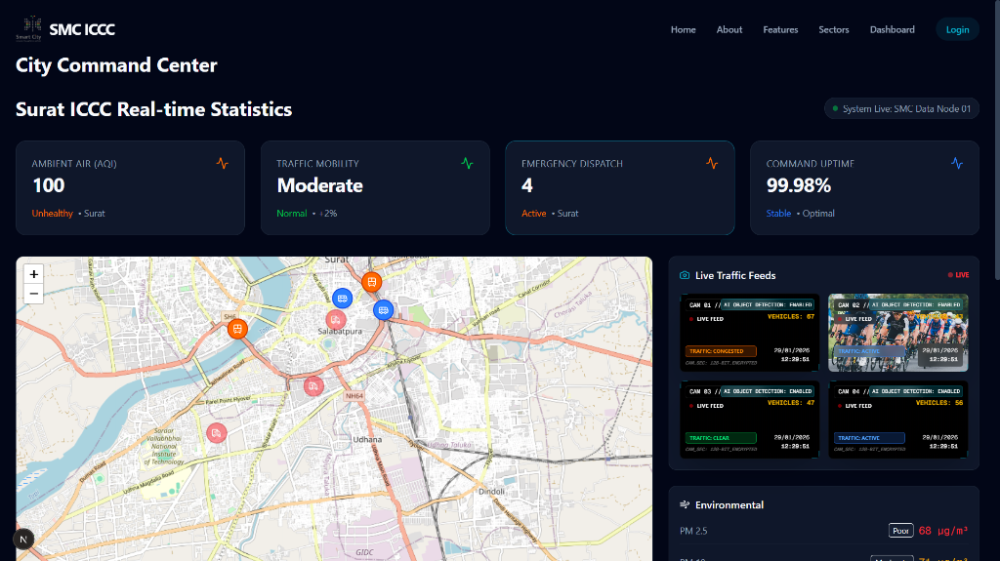
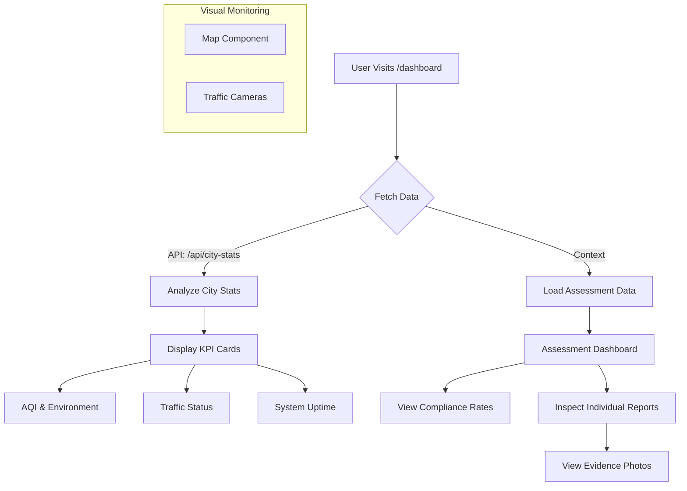
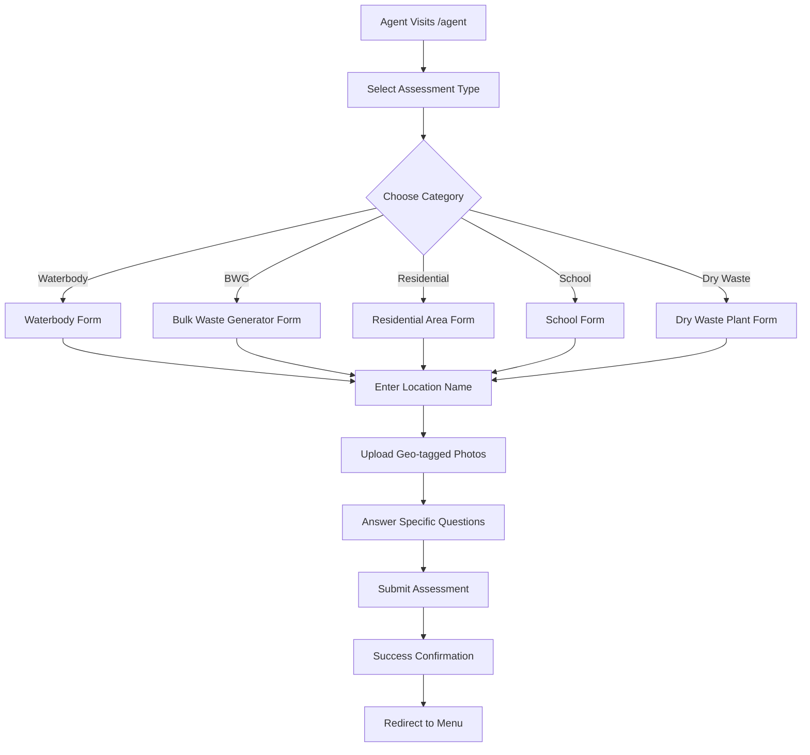

# SMC-ICCC (Surat Smart City - Integrated Command and Control Centre) Project Documentation

## 1. Project Overview
The **SMC-ICCC** project is a comprehensive digital platform designed for the Surat Municipal Corporation to centralize city monitoring and management. It serves as the digital brain of the city, integrating various data streams—environmental sensors, traffic cameras, emergency alerts, and field assessments—into a single, intuitive interface.

This project aims to enhance the quality of life for citizens by enabling data-driven governance, improving response times to urban issues, and ensuring transparency in civic operations.



---

## 2. Key Features

### 2.1 About the ICCC
The platform is designed to improve quality of life through data-driven governance, ensuring safety, security, and seamless public service delivery.



**Code Reference (`src/app/page.tsx`):**
```tsx
<section id="about" className="py-24 bg-secondary/30 border-y border-border">
    <div className="container px-6 mx-auto text-center">
        <h2 className="text-3xl font-bold mb-6">About the ICCC</h2>
        <p className="max-w-4xl mx-auto text-lg text-muted-foreground leading-relaxed">
        The Integrated Command and Control Centre (ICCC) is a cornerstone of the Smart City mission.
        Designed to improve the quality of life for citizens, it ensures safety, security, and seamless public service delivery through data-driven governance.
        By integrating surveillance, traffic management, and utility monitoring into a centralized platform, the ICCC enables real-time decision-making and rapid emergency response.
        </p>
    </div>
</section>
```

### 2.2 Core Capabilities
The ICCC empowers Surat with cutting-edge technology, featuring real-time analytics, centralized monitoring, AI-powered detection, and automated alerts.



**Code Reference (`src/components/Features.tsx`):**
```tsx
const features = [
    {
        icon: Database,
        title: 'Real-time Analytics',
        description: 'Processing millions of data points from sensors city-wide to provide actionable insights instantaneously.'
    },
    {
        icon: Monitor,
        title: 'Centralized Monitoring',
        description: 'A single pane of glass view for all city operations, traffic, and emergency services.'
    },
    {
        icon: Cpu,
        title: 'AI-Powered Detection',
        description: 'Advanced computer vision algorithms to automatically detect traffic violations, potholes, and waste accumulation.'
    },
    // ... more features
];
```

### 2.3 Integrated Sectors
The system integrates various urban management sectors including Traffic & Mobility, Waste Management, Safety & Surveillance, and Smart Lighting.



**Code Reference (`src/components/Sectors.tsx`):**
```tsx
const sectors = [
    {
        icon: Car,
        title: 'Traffic & Mobility',
        stat: 'ITMS Phase II Active',
        image: 'https://images.unsplash.com/photo-1494522855154-9297ac14b55f?q=80&w=2070'
    },
    {
        icon: Trash2,
        title: 'Waste Management',
        stat: '98% Door-to-Door Compliance',
        image: 'https://images.unsplash.com/photo-1532996122724-e3c354a0b15b?q=80&w=2070'
    },
    // ... other sectors
];
```

---

## 3. Real-time Dashboard
The dashboard provides a centralized view of critical city metrics, including live traffic feeds and environmental data.



### 3.1 Live Traffic Camera Component
The `TrafficCamera` component simulates a live CCTV feed with overlay data for traffic status and vehicle counts.

**Code Reference (`src/components/TrafficCamera.tsx`):**
```tsx
export default function TrafficCamera({ id, location, status, imageUrl }: TrafficCameraProps) {
    // ... state management for time and vehicle count

    return (
        <div className="group relative aspect-video bg-black rounded-lg overflow-hidden border border-border/50 shadow-2xl transition-all duration-300 hover:border-primary/50">
            {/* Real Visual Background */}
            <div
                className="absolute inset-0 bg-cover bg-center transition-transform duration-[10s] group-hover:scale-110"
                style={{ backgroundImage: `url('${imageUrl}')` }}
            />

            {/* AI Analytics Overlay */}
            <div className="absolute top-2 right-2 z-20 text-right font-mono text-white space-y-0.5">
                <div className="text-[8px] bg-primary/20 text-primary-foreground px-1 py-0.5 rounded border border-primary/30 backdrop-blur-sm">
                    AI OBJECT DETECTION: ENABLED
                </div>
                <div className="text-[10px] font-bold text-yellow-500 drop-shadow-md">
                    VEHICLES: {vehicleCount > 0 ? vehicleCount : '...'}
                </div>
            </div>
            {/* ... other overlays */}
        </div>
    );
}
```

### 3.2 Dashboard Data Integration
The dashboard page fetches real-time stats and displays them in a responsive grid.

**Code Reference (`src/app/dashboard/page.tsx`):**
```tsx
export default function Dashboard() {
    const [cityStats, setCityStats] = React.useState<any>(null);

    const fetchStats = async () => {
        try {
            const res = await fetch('/api/city-stats');
            const data = await res.json();
            setCityStats(data);
        } catch (error) {
            console.error('Failed to fetch stats:', error);
        }
    };

    React.useEffect(() => {
        fetchStats();
        const interval = setInterval(fetchStats, 300000); // Refresh every 5 minutes
        return () => clearInterval(interval);
    }, []);

    // ... render logic
}
```

---

## 4. User Flows

### 4.1 Public / City Official Flow (Dashboard)
This flow represents how a city official or administrator monitors the city's status.



### 4.2 Field Agent Flow (Data Collection)
This flow illustrates how field agents submit ground-level data.



---

## 5. API Reference

### GET `/api/city-stats`
Fetches real-time (and simulated) statistical data for the city.

**Response Structure (JSON):**
```json
{
  "aqi": {
    "value": "169",
    "status": "Poor",
    "color": "text-red-500",
    "pm25": { "value": "58 µg/m³", "status": "Moderate" },
    "pm10": { "value": "60 µg/m³", "status": "Moderate" },
    "humidity": { "value": "65%", "status": "Optimal" }
  },
  "traffic": {
    "value": "Moderate",
    "status": "Normal",
    "trend": "+2%"
  },
  "alerts": {
    "value": "5",
    "status": "Active"
  },
  "uptime": {
    "value": "99.98%",
    "status": "Stable"
  }
}
```

---

## 6. Real-World Impact
1.  **Enhanced Situational Awareness**: By aggregating data in one place, city administrators can see the "big picture" (e.g., correlating high traffic with poor AQI) and make informed decisions.
2.  **Resource Optimization**: Knowing exactly where traffic is heavy or where waste is accumulating (via field reports) allows for the precise deployment of police or sanitation workers.
3.  **Proactive Governance**: Instead of waiting for citizen complaints, the ICCC allows the administration to detect issues (like rising particulate matter or traffic jams) proactively.

---

## 7. Swachh Bharat Mission (SBM) Alignment
This project is deeply integrated with the goals of the Swachh Bharat Mission (Clean India Mission):

1.  **Centralized Garbage Monitoring**: The **BWG (Bulk Waste Generator)** and **Dry Waste** assessment modules allow the corporation to track if large entities (hotels, societies) are managing waste correctly.
2.  **Water Body Rejuvenation**: The **Waterbody** assessment checklist (checking for floating waste, weeds, open dumping) directly supports the SBM goal of keeping water bodies clean.
3.  **Digital "Swachhata" Audit**: The **Agent Portal** digitizes the inspection process. Instead of paper forms, agents upload real-time photos (`geo-tagged` capable) of dumpsites (GVPs - Garbage Vulnerable Points), ensuring accountability and irrefutable proof of work.
4.  **Compliance Tracking**: The dashboard calculates **"Compliance Rates"** automatically. This gamification and metric-tracking drives better performance from different zones/wards in the city.
